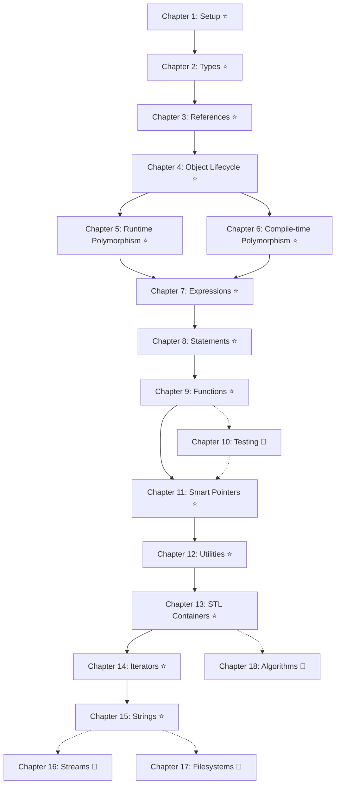

# 📚 C++ Course for Python/Java Programmers - Master Index

## 🎯 Course Overview

This is a **strategically designed 15-week C++ course** with **14 mandatory chapters** designed specifically for students with Python or Java backgrounds. The course combines **academic rigor** with **professional development tools**, featuring full VS Code and Docker integration.

### **Course Philosophy**
- **10-hour weekly commitment** for average students (not hardcore CS majors)
- **Three flexible development workflows** to accommodate different learning styles
- **Visual debugging emphasis** to make complex C++ concepts intuitive
- **Professional tooling** from day one (Docker, VS Code, Git/GitHub)

---

## 🚀 Quick Start Paths

### **👋 New Students - Start Here**
1. **Read**: [`GETTING_STARTED.md`](GETTING_STARTED.md) - Essential onboarding guide
2. **Choose Workflow**: [`chapter_01_development_workflows.md`](chapter_01_development_workflows.md)
3. **Setup Environment**: Pick your setup guide below
4. **Begin Chapter 1**: Your C++ journey starts!

### **👨‍🏫 Instructors - Course Delivery**
1. **Review**: [`INSTRUCTOR_GUIDE.md`](INSTRUCTOR_GUIDE.md) - Course delivery overview
2. **Technical Setup**: [`infrastructure/`](csci330_f25/) - Docker and VS Code configurations
3. **Assessment Tools**: All rubrics and timing guides included per chapter

### **🔧 Developer Setup Options**
| Workflow | Best For | Setup Guide |
|----------|----------|-------------|
| **VS Code + Docker** ⭐ | Most students | [`chapter_01_vscode_setup.md`](chapter_01_vscode_setup.md) |
| **Pure Docker/CLI** | Linux enthusiasts | [`chapter_01_docker_setup.md`](chapter_01_docker_setup.md) |
| **VS Code + Local** | Quick start | [`chapter_01_vscode_setup.md`](chapter_01_vscode_setup.md) |

---

## 📖 Chapter Structure & Navigation

### **File Types Legend**
- 📋 **Lesson Plan** - Core learning content and activities (2.5 hours)
- 🧩 **Problems** - Hands-on programming exercises (2.25 hours)  
- 🔍 **Debugging Guide** - VS Code debugging techniques (Chapters 2+)
- ⚡ **Quick Help** - Reference cards and common solutions
- 💡 **Solutions** - Complete solutions with explanations

---

## 🗺️ Core Curriculum Map (14 Mandatory Chapters)

### **📚 Part I: Foundations (Chapters 1-4)** ⭐ MANDATORY
*Master the fundamentals with modern tooling*

| Chapter | Topic | Core Files | VS Code Features |
|---------|-------|------------|------------------|
| **01** ⭐ | Up and Running | [📋 Lesson](chapter_01_lesson_plan.md) • [🧩 Problems](chapter_01_problems_revised.md) | Environment setup, basic debugging |
| **02** ⭐ | Types & Memory | [📋 Lesson](chapter_02_lesson_plan.md) • [🧩 Problems](chapter_02_problems_revised.md) • [🔍 Debug Guide](chapter_02_debugging_guide.md) | **Memory visualization, pointer debugging** |
| **03** ⭐ | References | [📋 Lesson](chapter_03_lesson_plan.md) • [🧩 Problems](chapter_03_problems_revised.md) | Reference alias visualization |
| **04** ⭐ | Object Lifecycle | [📋 Lesson](chapter_04_lesson_plan.md) • [🧩 Problems](chapter_04_problems_revised.md) | Constructor/destructor tracking, RAII |

### **🏗️ Part II: Object-Oriented Programming (Chapters 5-6)** ⭐ MANDATORY
*Master C++ object-oriented features*

| Chapter | Topic | Core Files | VS Code Features |  
|---------|-------|------------|------------------|
| **05** ⭐ | Runtime Polymorphism | [📋 Lesson](chapter_05_lesson_plan.md) • [🧩 Problems](chapter_05_problems_revised.md) | Virtual function dispatch visualization |
| **06** ⭐ | Compile-time Polymorphism | [📋 Lesson](chapter_06_lesson_plan.md) • [🧩 Problems](chapter_06_problems_revised.md) | Template instantiation debugging |

### **⚙️ Part III: Language Mechanics (Chapters 7-9)** ⭐ MANDATORY
*Deep dive into C++ language features*

| Chapter | Topic | Core Files | VS Code Features |
|---------|-------|------------|------------------|
| **07** ⭐ | Expressions | [📋 Lesson](chapter_07_lesson_plan.md) • [🧩 Problems](chapter_07_problems_revised.md) | Expression evaluation order |
| **08** ⭐ | Statements | [📋 Lesson](chapter_08_lesson_plan.md) • [🧩 Problems](chapter_08_problems_revised.md) | Control flow and exception debugging |
| **09** ⭐ | Functions | [📋 Lesson](chapter_09_lesson_plan.md) • [🧩 Problems](chapter_09_problems_revised.md) | Lambda capture visualization |

### **🧪 Part IV: Modern C++ Essentials (Chapters 11-15)** ⭐ MANDATORY
*Professional development and standard library mastery*

| Chapter | Topic | Core Files | VS Code Features |
|---------|-------|------------|------------------|
| **11** ⭐ | Smart Pointers | [📋 Lesson](chapter_11_lesson_plan.md) • [🧩 Problems](chapter_11_problems_revised.md) | **Ownership transfer, reference counting** |
| **12** ⭐ | Utilities | [📋 Lesson](chapter_12_lesson_plan.md) • [🧩 Problems](chapter_12_problems_revised.md) | Optional/variant state visualization |
| **13** ⭐ | STL Containers | [📋 Lesson](chapter_13_lesson_plan.md) • [🧩 Problems](chapter_13_problems_revised.md) | **Container content inspection** |
| **14** ⭐ | Iterators | [📋 Lesson](chapter_14_lesson_plan.md) • [🧩 Problems](chapter_14_problems_revised.md) | Iterator traversal patterns |
| **15** ⭐ | Strings | 📋 *Lesson Plan Available* • 🧩 *Problems Available* | String manipulation, text processing |

---

## 🎁 Optional Enhancement Chapters (Choose Based on Time/Interest)

### **📝 Professional Skills & Advanced Topics**

| Chapter | Topic | Purpose | When to Include |
|---------|-------|---------|-----------------|
| **10** 📖 | Testing | TDD, unit testing practices | Extra week available, professional focus |
| **16** 📖 | Streams | I/O operations, file handling | Need practical file operations |
| **17** 📖 | Filesystems | File system manipulation | System programming focus |
| **18** 📖 | Algorithms | STL algorithms, functional programming | Advanced STL usage, performance focus |

---

## 🔗 Mandatory Chapter Prerequisites Flow

### **Mandatory Prerequisites (Core Path)**
- **Chapters 1-2**: Foundation for all subsequent chapters
- **Chapters 2-4**: Essential for understanding modern C++ memory management
- **Chapters 5-6**: Both polymorphism approaches are mandatory for complete understanding
- **Chapter 9**: Functions knowledge required before smart pointers
- **Chapters 11-15**: Complete modern C++ STL mastery

### **Optional Chapter Integration Points**
- **Chapter 10**: Can be inserted after Chapter 9 or used for professional development focus
- **Chapters 16-18**: Can be added after Chapter 15 or used selectively based on course goals

---

## 🛠️ Development Environment

### **Docker Infrastructure** 
- **Location**: [`csci330_f25/`](csci330_f25/)
- **Features**: Ubuntu 22.04, GCC, CMake, Catch2, debugging tools
- **VS Code Integration**: `.devcontainer.json` for seamless setup

### **VS Code Configuration**
- **Settings**: Optimized for C++ development with IntelliSense
- **Tasks**: Build automation for all workflows
- **Launch Configs**: Debugging setups for different chapter concepts
- **Extensions**: Recommended extensions for C++ learning

### **Assignment Templates**
- **Structure**: Professional CMake-based projects
- **Testing**: Catch2 integration for all assignments
- **Workflow**: Git/GitHub submission process

---

## 📊 Assessment & Timing Strategy

### **15-Week Schedule Overview**
- **14 Mandatory Chapters** over 15 weeks = strategic pacing with breathing room
- **Flexible scheduling**: Some weeks focus on single challenging chapters, others integrate concepts
- **Optional chapters**: Used for advanced students, extra credit, or course customization

### **Time Budget (Per Mandatory Chapter)**
- **Learning Content**: 2.5 hours maximum
- **Problem Sets**: 2.25 hours maximum  
- **Total Commitment**: ~4.75 hours per chapter (allows for review/integration time)

### **Sample 15-Week Schedule**
| Week | Content | Focus |
|------|---------|-------|
| **1** | Chapter 1 | Environment setup, first programs |
| **2** | Chapter 2 | Memory concepts (extra time for debugging) |
| **3** | Chapter 3 | References and aliases |
| **4** | Chapter 4 | Object lifecycle and RAII |
| **5** | Chapters 5-6 | Both polymorphism approaches |
| **6** | Chapter 7 | Expressions and operators |
| **7** | Chapter 8 | Control flow and exceptions |
| **8** | Chapter 9 | Advanced functions |
| **9** | **Integration Week** | Review Chapters 1-9 |
| **10** | Chapter 11 | Smart pointers |
| **11** | Chapter 12 | Modern utilities |
| **12** | Chapter 13 | STL containers |
| **13** | Chapter 14 | Iterators |
| **14** | Chapter 15 | String processing |
| **15** | **Final Projects** | Integration + Optional chapters |

### **Assessment Strategy**
- **Formative**: Continuous feedback through problem sets
- **Summative**: Pass/fail projects emphasizing understanding over perfection
- **Professional Skills**: Git workflow, code review, debugging proficiency
- **Optional Content**: Extra credit, advanced student challenges, or course customization

---

## 🔍 Quick Reference & Troubleshooting

### **Common Issues**
- **Docker Problems**: [`docker_troubleshooting.md`](docker_troubleshooting.md)
- **VS Code Issues**: [`chapter_02_workflow_tips.md`](chapter_02_workflow_tips.md)
- **Compilation Errors**: Each chapter's Quick Help guide

### **Workflow Comparison**
- **Decision Tree**: [`chapter_01_development_workflows.md`](chapter_01_development_workflows.md)
- **Setup Comparison**: Pros/cons of each approach
- **Migration Guide**: How to switch between workflows

### **Language Bridges**
- **Python Equivalents**: Highlighted in each lesson plan
- **Java Comparisons**: Side-by-side syntax and concept maps
- **Migration Tips**: Leveraging existing programming knowledge

---

## 🎓 Learning Outcomes

By completing this course, students will:

### **Technical Skills**
- ✅ **Master C++ fundamentals** with proper memory management
- ✅ **Apply modern C++ practices** (smart pointers, STL, RAII)
- ✅ **Debug complex programs** using professional tools
- ✅ **Write testable, maintainable code** following industry practices

### **Professional Skills**  
- ✅ **Use professional development environments** (VS Code, Docker)
- ✅ **Follow Git/GitHub workflows** for code collaboration
- ✅ **Apply debugging methodologies** for complex software
- ✅ **Understand build systems** (CMake) and testing frameworks

### **Bridge Skills**
- ✅ **Transition smoothly** from Python/Java to C++
- ✅ **Understand performance implications** of different approaches
- ✅ **Apply object-oriented principles** in a systems programming context
- ✅ **Make informed technology decisions** based on trade-offs

---

## 📈 Course Statistics

### **Core Curriculum (Mandatory)**
- **📚 14 Mandatory Chapters** with full VS Code integration
- **🧩 300+ Programming Problems** across all difficulty levels  
- **🔍 12+ Debugging Guides** for complex concepts
- **⚡ 14 Quick Reference Cards** for instant help
- **💡 Complete Solution Sets** with detailed explanations

### **Flexible Enhancement (Optional)**
- **📖 4 Optional Chapters** for advanced topics and professional skills
- **🎁 50+ Additional Problems** for extended learning
- **🚀 Advanced Projects** for motivated students

### **Professional Development**
- **🛠️ 3 Development Workflows** to match student preferences
- **📋 Professional Assessment Rubrics** for all assignments
- **⚙️ Industry-Standard Tooling** (Docker, VS Code, Git/GitHub)
- **🎯 Strategic Pacing** with integration weeks for deep understanding

---

## 🚀 Get Started Now!

### **For Students**
1. Read [`GETTING_STARTED.md`](GETTING_STARTED.md)
2. Choose your workflow from [`chapter_01_development_workflows.md`](chapter_01_development_workflows.md)
3. Complete the setup for your chosen workflow
4. Start with [Chapter 1: Up and Running](chapter_01_lesson_plan.md)

### **For Instructors**
1. Review [`INSTRUCTOR_GUIDE.md`](INSTRUCTOR_GUIDE.md)
2. Set up the Docker environment using [`csci330_f25/`](csci330_f25/)
3. Test VS Code integration with provided configurations
4. Customize timing and assessment as needed

---

**Welcome to the most comprehensive C++ learning experience available! This course bridges the gap between academic learning and professional development, giving you both deep C++ knowledge and industry-relevant skills.** 🚀

*Course developed with full VS Code integration, Docker containerization, and modern C++ best practices. Designed for Python/Java programmers ready to master systems programming.*